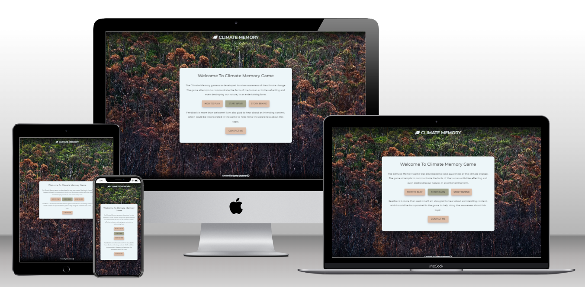
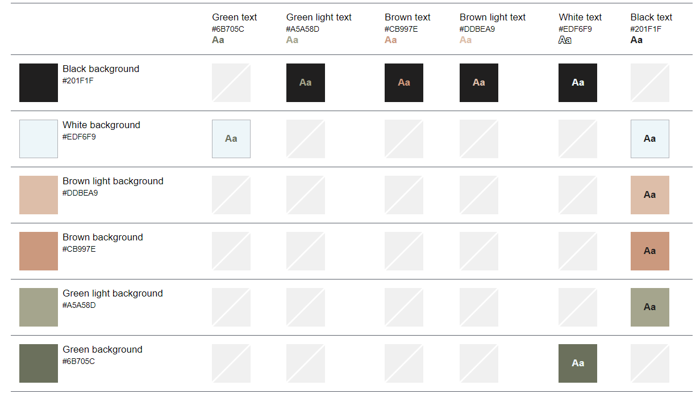
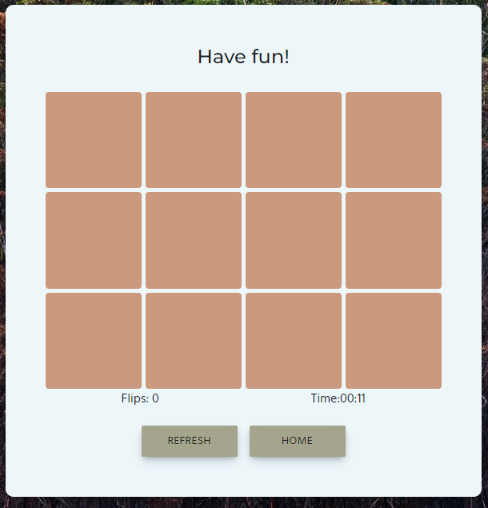

## Introduction
The Climate Memory website was created to raise awareness of the climate change. The website attempts to present the facts of the human activities effecting the nature and the life of other people including our children.

The website was developed as a memory game with additional features. In contrast to the classical memory game, the user tries to match an image with an corresponding image description. The content of the flipped card is everytime magnified in order to read the text or see the image properly.

The game is particularly for adults or children who can already read. The website could be used at schools for educative purposes as it provides evidence-based facts.

Click <a href="https://brodsa.github.io/climate-memory/" target="_blank"> here </a> to view the website and to play the game!

---

## Table of Contents
- [UX](#ux)
- [Features](#features)
- [Testing](#testing)
- [Deployment](#deployment)
- [References](#references)
- [Acknowledgements](#acknowledgemetns)

---

## UX
The purpose of the game is to communicate the facts about the climate change in an appealing and user-friedly way. The playing of the game is fun and informative at the same time. Moreover, the game can be played on various devices. 

### User Stories
- **First-Time User Goals**
    - US1: As a first-time visitor, I want to understand the purpose of the gama.
    - US2: As a first-time visitor, I want to the game is fun and interactive.
    - US3: As a first-time visitor, I want to found out interesting information about the climate change.
    - US4: As a first-time visitor, I want to understand the game rules.
    - US5: As a first-time visitor, I want to play the game on my mobile phone. 
    - US6: As A first-time visitor, I want to easily navigate through the webpage content.

- **Returning Visitor Goals**
    - US7: As a returning visitor, I want to found out more facts about the climate change.
    - US8: As a returning visitor, I want to suggest the developer to include additional facts or to provide him a feedback.

### Wireframes
The wireframes of the website were designed using [Balsamiq](https://balsamiq.com/wireframes/?gad=1&gclid=CjwKCAjwg-GjBhBnEiwAMUvNW8jCWKFMpgnd5PZlvwNQGIt7xJ05Fes_JeSsBSzyr7ToVpReN5VdOBoC80UQAvD_BwE). 
Two different layouts were mainly considered: 

- [Desktop Wireframe](https://github.com/brodsa/climate-memory/blob/main/assets/docs/ux/ux_wireframe_desktop.png)

- [Mobile Wireframe](https://github.com/brodsa/climate-memory/blob/main/assets/docs/ux/ux_wireframe_mobile.png)

### Fonts
Fonts were selected based on the [fontpair](https://www.fontpair.co/pairings/montserrat-hind). The fonts were included in the web page via the link tags, which were generated using the [Google Fonts](https://fonts.google.com/).

- The Montserrat was chosen for headings.
- The Hind was take for the body text, such as paragraphs.

### Colors
The color pallete which was chosen is [coolors](https://coolors.co/palette/cb997e-ddbea9-ffe8d6-b7b7a4-a5a58d-6b705c), with a slight modification. The final colors includes the Eerie Black and Alice Blue, see [here](https://coolors.co/201f1f-6b705c-a5a58d-edf6f9-ddbea9-cb997e).

The chosen colors were evaluated in terms of accessibitlity using the [toolnes](https://toolness.github.io/accessible-color-matrix/) tool. The resulting accessible color matrix revealed the following suggested combinations.

## Features
The website layout reflects the user stories as well as the components or functionality which are common practices in web design, including the responsivness (US5). In addition, the interactive elements were designed to provide the user with a feedback on the conductive activities.  

### Common Features
- **Header**
    - The Header is located at the top of the website.
    - The Header displays the logo of the game.

    

- **Footer**
    - The Footer is located at the bottom of the website.
    - The Footer displays the developer name the link to the GitHub profil.

    

### Homepage Features
The hompage contains a white board located in the middle of the screen. The board introduces the game (US1) and ask the user to contact the developer in order to expand the content of the game. In addition, there are four navigation buttons (US6).

The buttons directs the user to other webpage parts:
- **"How to play"** navigates the user to the game instruction (US4). The information is provided in the pop up window. In the window, there is also the button "Start game", which gives the user the possibility to start playing the game from there, see [How to play Modal](./assets/docs/features/features_homepage_popup_how_to_play.png).
- **"Start game"** navigates the user to the game board, which is located in a separeted page, see more Game Board Features Section.
- **"Story behind"** navigates the user to the story behind the game. The story is provided in the pop up window, see [Story behind Modal](./assets/docs/features/features_homepage_popup_story_behind.png)
- **"Contact me"** navigates the user to the contact form in the pop up window (US8). The contact form includes buttons for sending and clearing the provided information, see [Contact me Page](./assets/docs/features/features_homepage_popup_contact_me.png)

### Game Board Features
The game board is loacated in the middle of the webpage.

The game board contains the following static and interactive elements:
- **Card Board** 
    - The board consists of 6 card pairs leading to the 12 flip cards in total. Each pair is represented by a text and an image card. The text was selected by the developer and attemps to present the interesting facts about the climate change (US3). The image card can be an icon, a figure or an picture, which is somehow related to the text. 
    - The card board is fully built with JavaScript. The data are located in the json file and contains information for 9 card pairs. When the user clicks on Start game, the data cards are randomly selected. Thus, the user can play with the different set of cards (US7). 
    - The user is allowed to click on two cards only. When the user is clicking on a card, the card is flipped and automatically magnified to read the text and see the image properly. To close the the magnified card, the user has to click on the card again. Four situations can occure (US2):
        - The card stayes flipped if the card is the first flipped one.
        - The cards flip back in case of no match.
        - The cards stay flipped if they matches.
        - The card is flipped back in case the same card was flipped.
    - Several examples of the flipped card are following (US2):
        - [A text card is flipped](./assets/docs/features/features_game_board_fliped_card_text.png)
        - [An image card with an icon is flipped](./assets/docs/features/features_game_board_fliped_card_img.png)
        - [A image card with a figure is flipped](./assets/docs/features/features_game_board_fliped_card_figure.png)
        - [Two cards match](./assets/docs/features/features_game_board_match.png)
        - [All matches are founded](./assets/docs/features/features_game_board_all_matches.png)

- **Score Board**
    - The score board is shown right after the card board.
    - The board displays the number of flips and the time spent on playing the game.

- **Navigation Board**
    - The navigation board is located on the button of the game board (US6).
    - The board displays two buttons:
        - **Refresh Button** refreshes the game and the user starts the game from the beginning
        - **Home Button** navigates the user back to the homepage.
- **Win Board**
    - When all cards are flipped, the win board pops up. The board shows the logo, the final number of flips and the total time needed to reveal all cards (US2).
    - The board automatically disappears and the user can start the new game by clicking on the Refresh Button.  
 

### Hidden Pages
The webpage additionally contains two hidden pages:
- **Thank you** page is shown after the form submission.
- **404** page is displayed in case of an invalid URL.

  
   

### Differences to Design
- **Additional Features**
    - The Header and Footer components were originally not considered in the design.
    - The Contact Me modal was added to enable contacting the developer.

- **Not yet implented Features**
    - **Topics** 
        - The initial plan was to have the cards separated into topics, which the user can select. This will be implemented in the next iteration.
        - Possible solution is mainly to modify the data load in order to generate the cards content. 
        - The pop up window offering the user to click on different buttons related to the different topics.
        - Each topic is related to a separated json file, containing the data to generate the cards.
        - The buttons have the event listener on click firing the load data function. The function received the path to the json file depending on the selected topic. 
        - This would require to select all buttons with a specific data attribute and to use the `switch` operator to get the correct data, i.e. load correct data. 
    - **User Chart or Progress**
        - There are two options to implement this feature in the next iteration. Either to use the [localstorage](https://developer.mozilla.org/en-US/docs/Web/API/Window/localStorage) or the [Google sheets API](https://developers.google.com/sheets/api/quickstart/js).

### Future Enhancements
- Additional language could be used to target more users.
- More topics then intially planed to make the webpage more intersting and to raise even more the awareness.

## Testing
In generally, the website was continously tested after implementing a feature or styling a component. The main part of testing includes the thorough manual testing as well as webpage validating using existing tools, see [the detailed testing report](./README_testing.md). Besides the issues reported in the report, there were other issues to be fixed:

|       Bug & Issue     | Solution |
| --------------------- | ---------- |
| The text in the modal card is sometimes cut off. | All classes specific to the type of card were removed (i.e. card__modal--txt) after closing the card modal. To read the text properly, the size of the modal was increased.|
| The blue color of buttons on iPhones | The color was specify and `-webkit-appearance: none;` was set up on all selectors. |
| The scroll on the game board does not work on mobile devices.    | The property `justify-content: center` was removed from the class. In addtion the height/width and max-height/width were added to the css class.  |
| If the user clicks to fast on the card, the content of both cards is displayed in the card modal.  | The function makeBackgroundDark() was moved before the card modal appears. |
| My mentor pointed out on using the PascalCase instead of camelCase naming convention on two functions| The naming was corrected. 
---

## Deployment
The site was deployed to GitHub Pages. The steps to deploy the webpage were following: 
- In the GitHub repository, the Settings Section was selected.
- The Page Category on the left hand side was selected.
- Under the Branch Section, the source branch from the drop-down menu (e.g. master branch) was chosen.
- The Save Button was cliked on.
- The page url was generated, which indicates the successful deployment. 
  
The website can be viewed <a href="https://brodsa.github.io/climate-memory/" target="_blank"> here </a> 

During the development, the commit type was included in commit messages, following [the blog post](https://www.freecodecamp.org/news/how-to-write-better-git-commit-messages/).

## Clone the Repository
The repository can also be cloned locally, the steps are following:

1. On Git
    - Go to the repository, i.e. https://github.com/brodsa/mgv-vorau
    - You see the content of the repository, i.e. all the files are listed. On the right side at the top of the list, find the Code drop down button and click on it.
    - Copy the repository HTTPS link to the clipboard.
2. In the terminal (Note: git must be preinstalled) 
    - Open the terminal and navigate, where you want to clone the repository.
    - Type `git clone` and insert the content from the clipboard, leading to the command `git clone https://github.com/brodsa/climate-memory.git`. 
    - Once the project is cloned, you can start using the repository locally.

---
## Languages
- HTML
- CSS
- JavaScript
- Markdown

---
## References

### Credits & Insipirations

- JavaScript Tutorial & Documentations
    - [Web Dev Simplified](https://www.youtube.com/@WebDevSimplified)
    - [JavaScript DOM Manipulation](https://www.youtube.com/watch?v=5fb2aPlgoys)
    - [Code with Mosh](https://codewithmosh.com/p/ultimate-javascript-series)
    - Memory Game
        - [freeCodeCamp](https://www.youtube.com/watch?v=ZniVgo8U7ek)
        - [Ferenc Almasi](https://webtips.dev/memory-game-in-javascript?utm_content=cmp-true)
    - [Stack Overflow](https://stackoverflow.com/)
    - [W3schools](https://www.w3schools.com/js/default.asp)
    - [MDN Web Docs](https://developer.mozilla.org/en-US/)
- Data for the Memory Game
    - [Our world in data](https://ourworldindata.org/per-capita-co2)
    - [The Climate Book by Greta Thunberg](https://www.amazon.de/Climate-Book-Greta-Thunberg/dp/0241547474/ref=sr_1_1?adgrpid=73939651914&hvadid=352944569214&hvdev=c&hvlocphy=1030962&hvnetw=g&hvqmt=e&hvrand=2852190861556407914&hvtargid=kwd-1433668333381&hydadcr=24125_1739945&keywords=the+climate+book&qid=1685468438&sr=8-1)
    - [IEEP](https://ieep.eu/publications/carbon-inequality-in-2030-per-capita-consumption-emissions-and-the-1-5c-goal/#:~:text=To%20stay%20within%20this%20guardrail,every%20person%20on%20Earth%20today.)
    - [Fontawesome](https://fontawesome.com/)
    - [Temperature stripes](https://showyourstripes.info/s/globe) by [Ed Hawkins](http://www.met.reading.ac.uk/~ed/home/index.php)

### Technologies & Tools
- [Google Fonts]() was used to import the fonts into the style.css file.
- [Color Pallete](https://coolors.co/palette/006d77-83c5be-edf6f9-ffddd2-e29578) was used to select accessible colors.
- [Image Compressor](https://tinypng.com/) was used to compress the images.
- [Image Converter](https://ezgif.com/) was used to convert all images in the webp format.
- [Favicon](https://realfavicongenerator.net/) was used to generate the code and files for the webpage favicon.
- [GitHub](https://github.com/) was used to store the code and host the website.
- [Gitpod](https://www.gitpod.io/) is an IDE and was used to develop the website.
- [Formsubmit](https://formsubmit.co/) was used for the form submission.
- [Mockup Generator](https://techsini.com/multi-mockup/?url=http://www.example.com) was used to generate the mockup for README.
- [Balsamiq](https://balsamiq.com/wireframes/?gad=1&gclid=CjwKCAjwg-GjBhBnEiwAMUvNW8jCWKFMpgnd5PZlvwNQGIt7xJ05Fes_JeSsBSzyr7ToVpReN5VdOBoC80UQAvD_BwE) was used to create wireframes.
- [Markdown Generator](https://tabletomarkdown.com/convert-spreadsheet-to-markdown/)

## Acknowledgements
I would like to thank my mentors, [Gareth McGirr](https://github.com/Gareth-McGirr) and [Daisy McGirr](https://github.com/Daisy-McG), for their guidance through my project and their valuable inputs. I would like to give a mention to [Lammer Helmuth](https://github.com/lammer-technikum?tab=overview&from=2023-05-01&to=2023-05-31) for his time and for giving me valuable feedback on my source code. He has provided me with information about the best practices. And my special thanks go to my husband for being supportive during the development of the webpage.